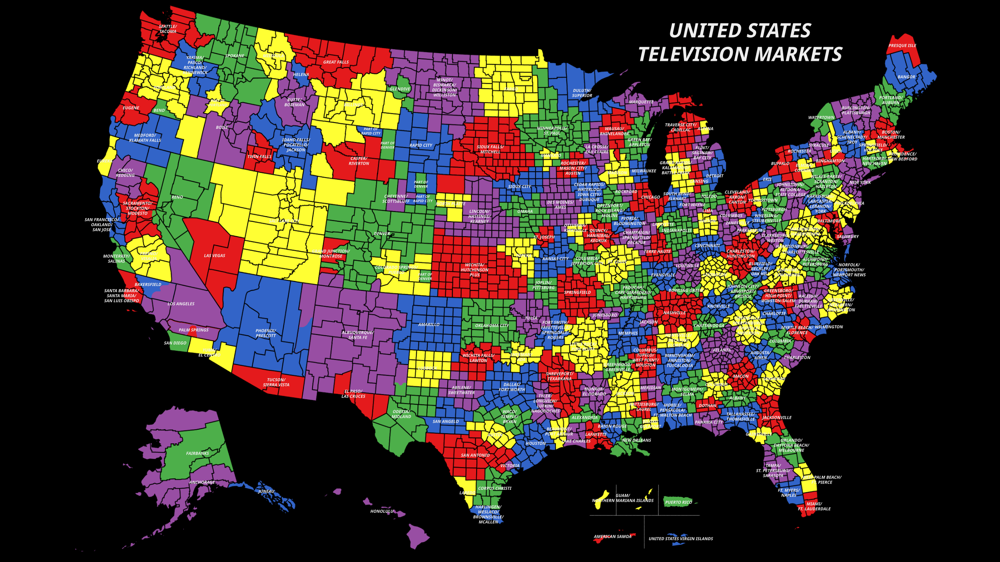
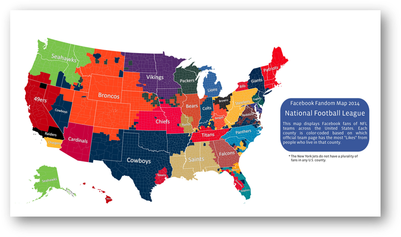

```{r setup, include=FALSE}
knitr::opts_chunk$set(echo = TRUE, warning = FALSE)
```

# 1. Overview

The Super Bowl is an annual championship game between 2 teams in the National Football League. Millions of viewers in the U.S. and around the world watch the Super Bowl and advertisers can spend a sizable amount of money for a 30-second TV ad. Budweiser was the exclusive beer brand to advertise nationally during the Super Bowl but in 2023, its parent company Anheuser-Busch InBev ended its exclusivity, allowing other brands the opportunity to advertise for the first time in decades.

In this lab, we will examine the returns to advertising beer during the Super Bowl. We will use 2 data sources, including one scraped from Wikipedia.

# 2. Web Scraping

First, let's install some packages (we only need to install each package one time on a computer). After installing, put a # in front of the text to comment out the line.
```{r, message = FALSE}
#tinytex::reinstall_tinytex(repository = "illinois")


#install.packages("tidyverse")
#install.packages("rvest")
#install.packages("stringr")
#install.packages("tidyr")
#install.packages("jtools")
#install.packages("gt")
#install.packages("scales")
#install.packages("stargazer")
#install.packages("grafify")
#install.packages("rlang")

```

Next, let's load the libraries (we must do this every time we start R Studio).
```{r, message = FALSE}
library(tidyverse)
library(rvest)
library(stringr)
library(tidyr)
library(jtools)
library(gt)
library(scales)
library(stargazer)
library(grafify)
options(dplyr.summarise.inform = FALSE)
```

We use the read_html function to read a web page. This function is provided by the xml2 package, which was loaded automatically when we loaded rvest.
```{r}
url = 'https://en.wikipedia.org/wiki/Super_Bowl_television_ratings'
webpage = read_html(url)
```

Next, we use the functions html_nodes and html_table to extract an HTML table element and convert it to a data frame.
```{r}
table = html_nodes(webpage, 'table')
SB = html_table(table)[[1]]
```

# 3. Data Cleaning

The imported dataframe needs to be cleaned up a bit. Let's delete the first row, which repeats the text headings. We will also delete some columns that we will not use. Let's relabel the column headings to be more concise.
```{r}
SB = SB[-(1:1), ]
SB = SB[,c(1,2,3,4,9)]
names(SB) = c("Number", "Date", "Network", "ViewersMillions", "Ad30sec")
(SB)
```

Notice that we need to remove the bracket with a number, like "[13]" from a Wikipedia reference.  We will use the gsub() function which substitutes the left bracket [ and subsequent text with an empty "".
```{r}
SB$ViewersMillions = gsub("\\[.*", "", SB$ViewersMillions)
SB$Ad30sec = gsub("\\[.*", "", SB$Ad30sec)
(SB)
```

Finally, let's reformat the variables from strings (characters) to the appropriate variable type.
```{r}
SB$Date = as.Date(SB$Date, "%B %d, %Y")
SB$ViewersMillions = as.numeric(SB$ViewersMillions)
SB$Ad30sec = as.numeric(gsub("[$,]", "", SB$Ad30sec))
(SB)
```

**QUESTION 1:** Calculate the total number of viewers for each Super Bowl. Note, Super Bowls I and LVIII both aired on two networks so we need to sum their viewers. Create a line plot showing total Super Bowl viewership by year.
```{r}


VIEWERSHIP <- SB %>%
  group_by(Number, Date) %>%
  summarize(TotalViewers = sum(ViewersMillions))

# Creating the plot
ggplot(data = VIEWERSHIP, aes(x = Date, y = TotalViewers)) +
  geom_line() + 
  scale_x_date(name = "", date_breaks = "5 years", date_labels = "%Y-%m-%d") +
  theme(axis.text.x = element_text(size = 10, angle = 45, colour = "black", hjust = 1)) +
  scale_y_continuous("Total viewership (millions)") +
  ggtitle("Super Bowl Viewership, 1967-2024")

```

**QUESTION 2:** Which year had the highest total TV viewership for the Super Bowl? What was the viewership?
```{r}
MaxIndex = which.max(VIEWERSHIP$TotalViewers)

MaxDate = VIEWERSHIP$Date[MaxIndex]  
MaxViewership = VIEWERSHIP$TotalViewers[MaxIndex]

print(MaxDate)
print(MaxViewership)
```
**ANSWER:** 
2024 had the Highest viewership of 121.5 million

**QUESTION 3:** Which of the TV networks has aired the most Super Bowls? Which network has the highest average TV viewership? Create a barplot of average TV viewership by network.
```{r}
NETWORKS = SB %>%
  group_by(Network) %>%
  summarize(
    MeanViewers = mean(ViewersMillions, na.rm = TRUE), # Calculate average viewership
    Aired = n() # Count the number of Super Bowls aired
  )
gt(NETWORKS)
```

```{r}
ggplot(data = NETWORKS, aes(x = Network, y = MeanViewers, label = round(MeanViewers, digits = 1), fill = Network)) +
  geom_col() + 
  geom_label(fill = "white") + 
  scale_fill_grafify("bright") + 
  scale_y_continuous("Average viewership (millions)") + 
  ggtitle("Super Bowl viewership by network, 1967-2024")

```

**ANSWER:** 
CBS has aired the most superbowls while fox has the heighest average viewership

**QUESTION 4:** What is the average cost of a 30-second ad over the 6 Super Bowls from 2006 to 2011?
```{r}
SB1 <- SB %>%
  mutate(Year = as.numeric(format(Date, "%Y"))) %>%  # Extract Year
  filter(Year >= 2006 & Year <= 2011)
SB_2006_2011 = SB1 %>%summarize(MeanCost = mean(Ad30sec, na.rm = TRUE))

cost = SB_2006_2011[[1]]
print(cost)

```
**ANSWER:** 
$ 2722330 is the avg 30 sec ad cost from 2006 to 2011

# 4. Data Collection

Let's set our working drive using setwd() and load the BEER dataset. 
```{r}
setwd("./")
BEER = read.csv("BEER.csv")
```
The BEER.csv file contains panel data on average household expenditures on beer after the Super Bowl. The dataset is based on the paper "Super Bowl Ads" by Hartmann and Klapper (*Marketing Science*, 2018). Special thanks to Professor Peter Rossi for proposing this analysis.

Each observation includes the following variables:

* **DMA:** Designated market area is a geographic area where TV ratings are measured by Nielsen
* **Brand:** Categorical variable for beer manufacturer
* **Year:** Year of Super Bowl (2006-2011)
* **NielsenRating:** Nielsen estimate of the proportion of households in DMA viewing Super Bowl that year
* **LocalTeamInSB:** Dummy variable that equals 1 if local team is playing in Super Bowl that year
* **PostRevenuePerWeek:** Average weekly beer expenditures per household in DMA in the 8-weeks post Super Bowl

Let's first visualize a map of all DMAs in the US. For the analysis below, we only use the top 50 DMAs as reported by Nielsen. Be sure to first save the .png file in your working directory.
```{r, echo=FALSE, fig.cap="Designated Market Areas (DMA)", fig.align = 'center', out.width = '100%'}

```

Next, let's see where fans of each NFL team tend to live, based on Facebook data.
```{r, echo=FALSE, fig.cap="National Football League (NFL) Team Popularity", fig.align = 'center', out.width = '100%'}

```


# 5. Panel Data

Let's create a dummy variable to indicate if a beer manufacturer has a Super Bowl ad. Note, in the time period analyzed, only Budweiser could advertise during the Super Bowl.
```{r}
BEER$Ad <- ifelse(BEER$Brand == "BUDWEISER", 1, 0)
unique(BEER$Year)
```

Create an interaction between the the ad dummy variable and Nielsen ratings. This new variable will capture our *treatment effect*: the proportion of households in a DMA who are exposed to a beer ad during the Super Bowl that year.
```{r}
BEER$AdXRating = BEER$Ad * BEER$NielsenRating
head(BEER$AdXRating)  # Ensure this column exists and has numeric values
summary(BEER$AdXRating)  # Check for missing or unusual values

```

Create a variable for Brand-DMA fixed effect. 
```{r}
BEER$BrandDMA = paste(BEER$Brand, BEER$DMA)
```

Create a variable for Brand-Year fixed effect.
```{r}
BEER$BrandYear = paste(BEER$Brand, BEER$Year)
```

**QUESTION 5:** How many BrandDMA categories (fixed effects) are there? How many BrandYear categories (fixed effects) are there?
```{r}

num_BrandDMA = length(unique(BEER$BrandDMA))
num_BrandYear = length(unique(BEER$BrandYear))
print(num_BrandDMA)
print(num_BrandYear)
```
**ANSWER:** 
BrandDMA categories (fixed effects) are 250 and  BrandYear categories are 30

**QUESTION 6:** Using the BEER dataset, let's examine the variation in Nielsen ratings based on whether the local team is playing in the Super Bowl. We will overlay 2 density plots (continuous versions of histograms). What might explain the different shapes of the 2 curves? 
```{r}
ggplot(data = BEER, aes(x = NielsenRating, fill = as.factor(LocalTeamInSB))) +
  geom_density(alpha = 0.5) + 
  scale_fill_grafify("bright", labels = c("No", "Yes")) +
  labs(fill = "Local Team in Super Bowl?") +
  scale_x_continuous("Percent of households watching Super Bowl", breaks = seq(0.3, 0.6, 0.05)) +
  ggtitle("Super Bowl viewership per designated market area")

```

**ANSWER:** 
Higher Nielsen Ratings When Local Team is Playing:

The blue curve, representing markets where the local team is in the Super Bowl, shows a distribution skewed towards higher ratings, with a peak around 0.55.This suggests that when a local team is in the Super Bowl, a larger proportion of households in that market tend to watch the game, resulting in higher Nielsen ratings.

Lower Nielsen Ratings When Local Team is Not Playing:

The pink curve, representing markets without a local team in the Super Bowl, is skewed slightly left, with a peak around 0.45.
This indicates that viewership is lower on average in these markets, as fewer households tune in when they do not have a direct stake in the outcome.

Overlap and Distribution Spread:

There is some overlap between the two curves, suggesting that even when the local team is not playing, certain markets still have high viewership, possibly due to the overall popularity of the Super Bowl.
However, the spread for "Yes" is slightly broader, indicating that local team participation adds variability to viewership levels, with a significant portion reaching higher ratings.


**QUESTION 7:** Calculate average Nielsen ratings per year. Are these constant or changing over time?  Plot a bar chart of average Nielsen ratings by year.
```{r}
NIELSEN = BEER %>%
  group_by(Year) %>%
  summarize(MeanRating = round(mean(NielsenRating, na.rm = TRUE), digits = 3))

ggplot(data = NIELSEN, aes(x = Year, y = MeanRating, label = MeanRating)) + 
  geom_col() + geom_label(color = "black", size = 4) +
  scale_x_continuous("", breaks = seq(2006, 2011, 1)) +
  scale_y_continuous("Percent of households watching Super Bowl") +
  ggtitle("Super Bowl viewership, 2006-2011")

```

**ANSWER:** 
They are changing over time (increasing)
**QUESTION 8:** Calculate average weekly household beer expenditures per year, by beer brand. Are Budweiser's average expenditures per household constant or changing over time?
```{r}
BEER$Brand = as.factor(BEER$Brand)

REVENUE = BEER %>%
  group_by(Year, Brand) %>%
  summarize(MeanRevenue = mean(PostRevenuePerWeek, na.rm = TRUE))

ggplot(data = REVENUE, aes(x = Year, y = MeanRevenue, color = Brand, label = paste0("$", round(MeanRevenue, digits = 2)))) +
  geom_line() + 
  geom_point(size = 12) + 
  geom_text(color = "white", size = 3) +
  scale_color_grafify("bright") +
  scale_x_continuous("", breaks = seq(2006, 2011, 1)) +
  scale_y_continuous("Mean weekly beer sales per household ($)") +
  ggtitle("Beer sales per household, 2006-2011")

```

**ANSWER:** 
They are changing over time (increasing)
# 6. Regression with Fixed Effects

Notice that since Super Bowl ratings AND Budweiser revenues are both increasing over this time period, this might lead to a spurious correlation between the two variables. But this could be just due to increasing trends overall: more people watch football and more people drink beer. 

Instead, we will take advantage of the following fact: *Different regions (DMAs) of the country are exposed to beer ads differentially over time, based on whether their local team is playing in the Super Bowl.*

Run a regression of post-Super Bowl revenue on our main treatment variable (AdXRating) and Nielsen ratings. Include year fixed effects.
```{r}
Regression1 <- lm(PostRevenuePerWeek ~ AdXRating + NielsenRating + factor(Year), data = BEER)

summ(Regression1)
```
Notice that in R, all the coefficients for Year are reported. We don't need to explicitly show these; we just want to include them in the regression to control for beer trends over time.

**QUESTION 9:** Repeat the last regression, replacing Year fixed effects with BrandYear fixed effects. 
```{r}
Regression2 <- lm(PostRevenuePerWeek ~ AdXRating + NielsenRating + factor(BrandYear), data = BEER)


summ(Regression2)
```

**QUESTION 10:** Repeat the last regression but include both BrandYear and BrandDMA fixed effects. This implicitly compares beer revenue within the same DMA, but only the Super Bowl ratings (and thus exposure to a Budweiser ad) are changing over time. We can suppress reporting these coefficients and instead include a line for Fixed Effects in the summary table.
```{r}
Regression3 <- lm(PostRevenuePerWeek ~ AdXRating + NielsenRating + factor(BrandYear) + factor(BrandDMA), data = BEER)
treatment <- coef(Regression3)["AdXRating"]
print(treatment)
stargazer(Regression1, Regression2, Regression3, type = "text",
          omit = c("Year", "BrandYear", "BrandDMA"),
          add.lines = list(c("Fixed Effects", "Year", "Brand x Year", "Brand x Year, Brand x DMA")))

```

**QUESTION 11:** What is your interpretation of the coefficient on AdXRating in Regression 3? Is this statistically significant at the 5% level? How does this compare to Budweiser's average revenue per household per week?
```{r}
treatment = Regression3$coefficients[[2]]

BUD = BEER %>%
  filter(Brand == "BUDWEISER")

weeklyrevenue = mean(BUD$PostRevenuePerWeek, na.rm = TRUE)
print(weeklyrevenue)
```
**ANSWER:** 
The coefficient for AdXRating in Regression 3 is 0.148, which is statistically significant at the 5% level
This coefficient suggests that for each unit increase in AdXRating (which represents the interaction between Budweiser's ad presence and Nielsen ratings), the post-Super Bowl weekly revenue per household increases by approximately 0.148 units. This indicates a positive effect of Super Bowl ads on Budweiser's weekly revenue per household.
The average weekly revenue per household for Budweiser, calculated in the output, is approximately 0.417.
The effect of AdXRating (0.148) represents about 35.5% (0.148 / 0.417) of Budweiser's average weekly revenue per household. This indicates that the impact of Super Bowl ads, as measured by AdXRating, is substantial compared to Budweiser's typical weekly revenue.

**QUESTION 12:** Assume there are about 100 million households in the US, but not everyone watches the Super Bowl. Given the average viewership for the Super Bowl (based on Nielsen ratings), what is Budweiser's extra revenue from the Super Bowl ads, assuming the boost lasts a full 8 weeks.
```{r}
viewership <- mean(BEER$NielsenRating, na.rm = TRUE)


treatment <- coef(Regression3)["AdXRating"]


extrarevenue = 100000000 * viewership * 8 * treatment
print(extrarevenue)
```
**ANSWER:** 
extra revenue $ 53556044 
**QUESTION 13:** Let's conservatively assume each Budweiser ad costs \$1 million to create. Using the average cost of a 30-second ad calculated (from Question 4 above), what is Budweiser's annual advertising costs assuming they air 9 Super Bowl ads each year? 
```{r}
cost = SB_2006_2011[[1]]  # From previous question
advertising = 9 * (cost + 1000000)
print(advertising)

```
**ANSWER:** 
$ 33500966 is the cost 

**QUESTION 14:** Based on this analysis, do Super Bowl beer commercials have a positive return on investment?

**ANSWER:** 
Yes, based on the extra revenue generated and the annual cost of advertising, Super Bowl commercials appear to provide a positive ROI for Budweiser.
